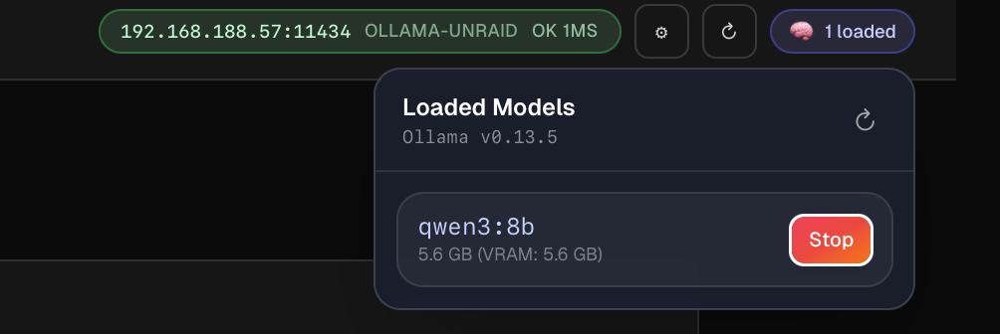
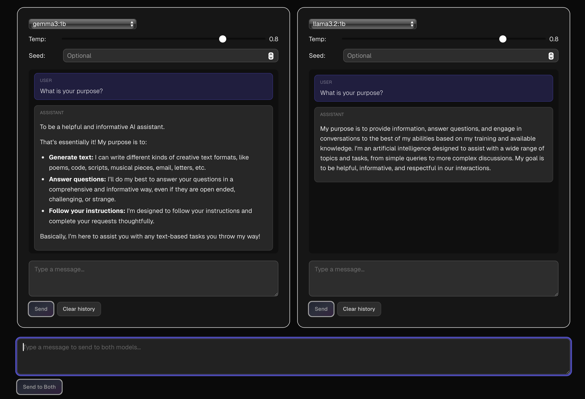
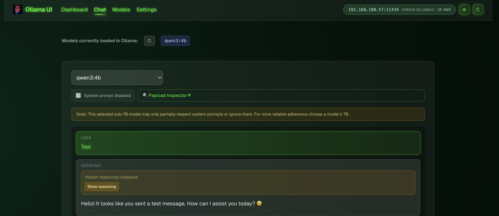
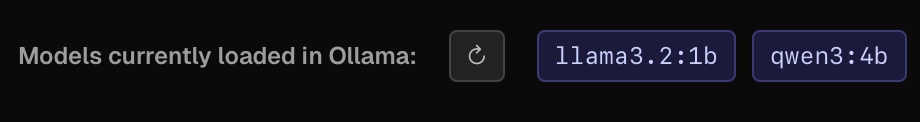
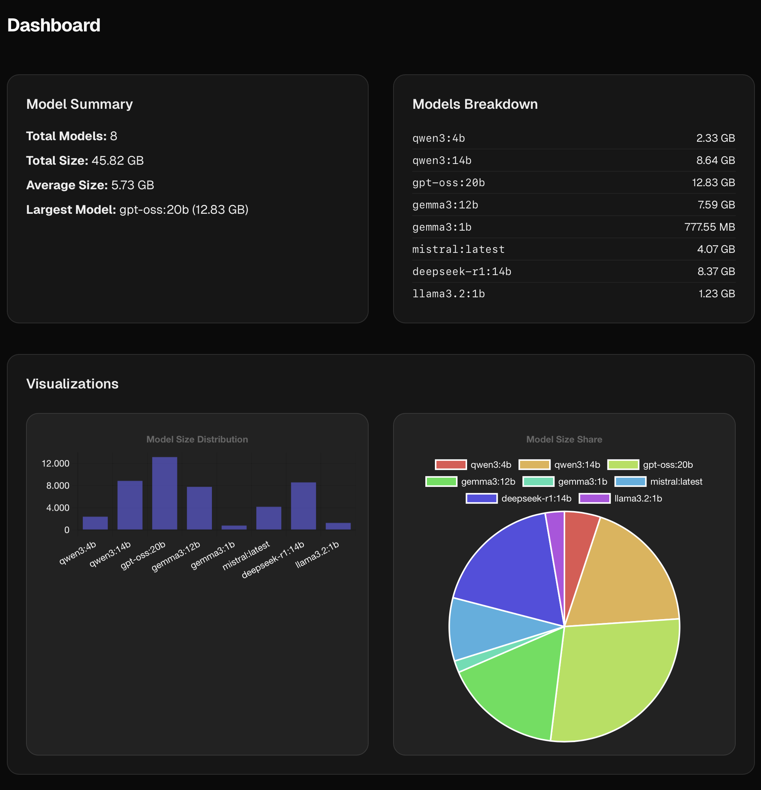
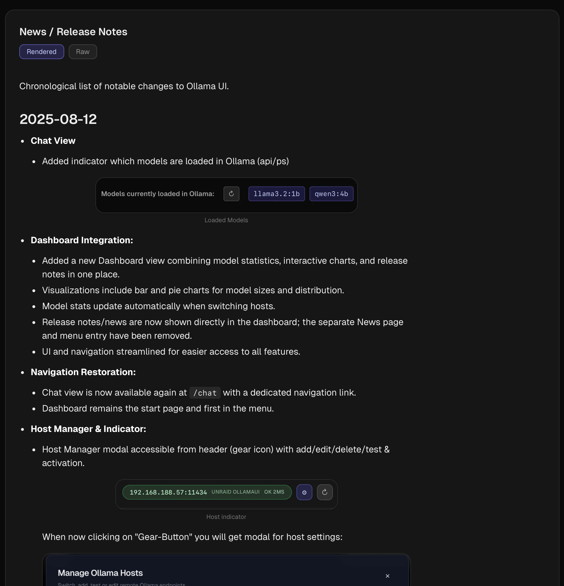
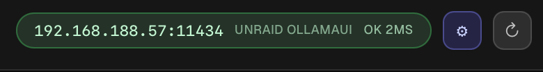
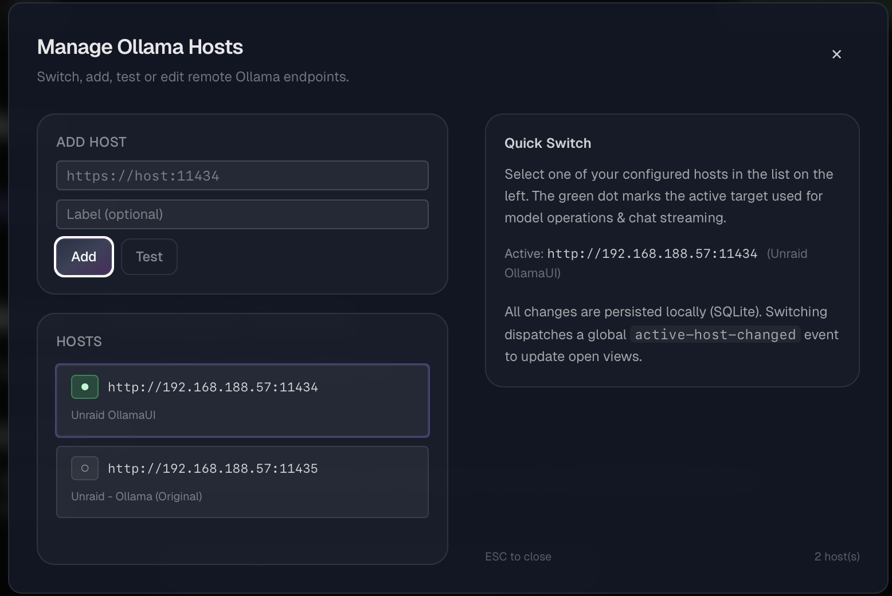

Chronological list of notable changes to Ollama UI.

## 2026-08-27

- **True Parallel Chats**
  - Sending a message in one chat no longer blocks sending in another. Previously, starting a reply in one session and then switching to a different session left the composer thinking it was still busy — generation state (loading/streaming indicators, Stop) was tracked once for the whole app instead of per session, so a reply running in the background in session A made session B look stuck too. The server already ran generation jobs fully independently; the client just couldn't keep up. Now each session (and each Compare column) tracks its own state, so switching sessions and firing off another chat while one is still generating works as expected.
  - Added a heads-up "Waiting on Ollama — N other request(s) already running for this model" indicator for the case where a second parallel chat has to wait its turn, instead of a stale "Loading model…" or an unexplained silent pause. Whether it actually runs alongside the other one depends on the Ollama server's own `OLLAMA_NUM_PARALLEL` setting and available VRAM — this app has no control over that, the indicator is just an honest "something else is using this model right now".
  - Fixed a hard failure ("Ollama did not respond within 180s (timed out)") that could hit a perfectly healthy chat simply because it was queued behind another parallel request to the same model — completely normal under Ollama's own concurrency limits, previously misreported as an error. The connection timeout now only starts counting once a reply has actually begun streaming; the wait for that first response is no longer time-limited at all.

- **Session Titles No Longer Depend on the Model**
  - A session's title is now derived directly from your first message (trimmed/truncated, no extra model call) instead of a separate background request asking the model to summarize the exchange. It appears instantly instead of after the reply finishes, and can no longer fail, hang, or show a stuck "Generating title…" because Ollama was busy with something else.

- **Math Formulas Now Render Properly**
  - Chat replies containing LaTeX math (`$$...$$` block or `$...$` inline — common when a model explains a formula) used to come through as raw, unreadable text. Now rendered properly via KaTeX, matching the current theme.

## 2026-08-26

- **Chat Generation Survives Closing the Tab**
  - Sending a message no longer ties the model's response to your browser connection. Generation now runs as a server-side job — close the tab, and it keeps going and saves normally; reopen it (or open a different tab or device on the network) and it picks the live response back up where it left off, including reasoning and tool-call traces.
  - **Stop** now actually cancels generation server-side instead of just hiding it in your tab.
  - A small "N generating" badge in the sidebar (visible on every page, not just Chat) shows what's still running; click it to jump straight to any of them. A toast pops up when a background reply finishes elsewhere, and the browser tab title flashes if you're not currently looking at it — no notification permissions or HTTPS required.

- **Unsupported Tool-Call Cleanup**
  - Some model fine-tunes emit a plain-text pseudo tool-call syntax for tools this app never declared, which used to stream through as raw, ugly tag soup. It's now detected live (shown as a clean "cleaning up…" indicator while streaming) and rendered as a normal, readable code block once the message finishes.
  - Every code block in chat now has its own hover **Copy** button, not just a whole-message copy.

- **Chat Composer & Layout Fixes**
  - A context-usage progress bar now sits right above the message box (in addition to the small badge up top), so you can see at a glance how full the context window is without hunting for it.
  - Fixed: while a model was still loading into memory, the chat showed the same "🦙 Thinking…" animation as actual reasoning — misleading, since the model hadn't started yet. It now clearly says "Loading model… Ns" until the first real token/thought arrives.
  - Fixed: the chat page was capped at a fixed max-width instead of filling the browser window, and — separately — message text itself was stuck at a ~65-character column width no matter how wide the window was (the `@tailwindcss/typography` plugin was never actually activated; a hand-rolled CSS fallback silently overrode the app's own `max-w-none`). Both now fill the available width properly.
  - Fixed: **Compact** could silently replace older chat history with a near-empty, garbage summary if the model returned a degenerate response (seen in practice: a single stray character) — now validated and rejected with a clear error instead of quietly losing context.

- **Dependency Security**
  - Patched 23 JS dependency advisories (Next.js middleware bypass/SSRF/DoS fixes among them) and an XXE advisory in the Python scraper's `lxml` dependency.

## 2026-08-25

- **Running Models Page**
  - New `/running` page — a live `ollama ps` equivalent showing every currently loaded model: CPU/GPU memory split (with a visual bar), effective context window, quantization/parameter-size/family badges, and a live countdown to when Ollama will auto-unload it.
  - Summary cards at the top total loaded models, VRAM in use and system RAM in use. One-click **Unload** button per model (reuses the existing stop/unload endpoint); the list auto-refreshes every 4 seconds. Reachable from the sidebar and the ⌘K command palette.

- **Chat Reliability Fixes**
  - Fixed a tool-calling bug where the model could silently lose its final answer: after exhausting the tool-call budget, a model's last tool request was dropped without ever letting it answer in plain text. The final iteration now omits tools entirely, forcing a real answer instead.
  - Session saves (send / regenerate / delete / compact) are now written in strict order per session — a slow, stale save can no longer land after a newer one and silently revert a chat to an earlier state after reload.
  - Errors during streaming now keep their real message instead of collapsing into a generic "[Chat error]"; failures are also logged to the console for easier debugging.
  - Added timeouts to the chat, auto-compact, title-generation and web-search requests, so a hung Ollama host or SearXNG instance can no longer leave a spinner running forever.

## 2026-07-19

- **Command Palette (⌘K / Ctrl+K)**
  - A global overlay (in the style of VS Code / Raycast) for jumping around the app fast: page navigation, switching or creating chat sessions, opening the host manager, and switching color themes — all searchable from one box.
  - Full keyboard navigation (↑↓ to move, ↵ to run, Esc to close); a small "⌘K" hint sits at the bottom of the sidebar.

- **Auto-Compact Context**
  - New "Auto-compact context" toggle in Settings → Context, with a threshold (60/70/80/90%).
  - Once a reply pushes the real runtime context usage above the threshold, older history is automatically summarized — same mechanism as the manual Compact button, including the 15-second Undo. Off by default; a 30-second cooldown prevents back-to-back auto-compactions.

- **Message Actions — Copy, Regenerate, Delete**
  - Every chat message now shows a small action bar on hover: copy the text to the clipboard, regenerate the last assistant reply (re-runs the same question through the model), or delete a question/answer pair.
  - Regenerate and delete are available per column in Compare mode without touching the other column, and are disabled while a reply is streaming.

- **Modern Glass Redesign (theme-adaptive)**
  - New ambient background: a slowly drifting aurora glow driven by the active theme's accent color, over a deep-space base with a subtle blueprint grid — every one of the 5 color themes gets matching ambience automatically.
  - App-wide glass design system: translucent cards with gradient hairline borders, hover lift + accent glow, gradient hero titles, and staggered entrance animations (respects `prefers-reduced-motion`).
  - Sidebar rebuilt with proper Lucide icons (emojis retired), accent-colored active states with a glowing indicator bar, and a refreshed logo.
  - Chat console polish: accent-tinted user bubbles, icon-based reasoning/tool trace lines, restyled composer, segmented Single/Compare control with accent glow.
  - Toasts got type icons and a slide-in animation; the host manager modal got entrance animations, accent styling and icon buttons. Scrollbars and text selection follow the theme accent too.

- **Dashboard Charts Rebuilt**
  - Model sizes now render as a sorted horizontal bar chart (long model names finally readable), colored with the live theme accent — switching themes recolors the chart instantly.
  - The size-share pie became a doughnut with a colorblind-safe, validated 8-color palette; beyond 7 models the rest folds into a neutral "Other" slice. Tooltips show real GB/MB values and percentages.

- **Context Compaction**
  - New **Compact** button in the chat composer: older messages are summarized by the model itself into a dense context note (facts, decisions and open questions survive; filler doesn't). The last 4 messages stay verbatim.
  - The summary appears as a collapsible "Compacted context" card in the conversation and replaces the old history in what gets sent to the model — with a 15-second Undo.
  - Works per column in Compare mode, each with its own model.

- **Honest Context Window Display**
  - The context badge previously showed the model's _architectural maximum_ from the registry (e.g. 262K) — but Ollama actually runs models with its server default (`num_ctx`, usually 4096) unless told otherwise, silently truncating anything beyond it.
  - The badge now shows the **real runtime window** reported by `/api/ps` once the model is loaded (e.g. `1.2K/4K ctx`); before that it shows `≤262.1K ctx` with an explanatory tooltip. The amber near-full warning now refers to the real limit.

- **Per-Model Context Slider (num_ctx)**
  - New gauge pill next to the context badge opens a slider ranging from 2K up to the selected model's maximum, with quick presets (4K/8K/16K/… /Max) and a reset to server default.
  - The chosen window is persisted per model, sent as `options.num_ctx` with every chat request _and_ during context compaction, and Ollama reloads the model with the new window on the next message.

## 2026-07-18

- **Chat "Console" Redesign**
  - Chat page rebuilt around a collapsible sidebar for sessions/profiles instead of an inline dropdown that used to push the conversation down every time it was opened.
  - Reasoning and tool calls now render as a single chronological trace (think → call a tool → think more → answer) instead of two disconnected blocks.
  - Playground has been merged into Chat as a "Compare" toggle — two columns sharing one composer, running through the exact same pipeline as normal chat, so tool-calling, reasoning and the new Stop button work in Compare mode too.
  - Added a Stop button to cancel an in-progress generation, and real upstream error messages instead of a generic "[Chat error]".
  - Fixed a bug where a thinking model's reasoning text got duplicated at the end of every response.

- **Tool-Calling: Web Search & Current Date**
  - Tool-capable models can now call `web_search` (via a self-hosted SearXNG instance) and `get_current_date` mid-conversation to answer with up-to-date information.
  - Configured once under Settings → Tools (master switch + SearXNG endpoint template) and applies to every chat; the app checks each model's capabilities automatically so the toggle warns you if the selected model doesn't support tools.

- **Whole-App "Console" Redesign**
  - The top navigation bar is gone, replaced by a single collapsible sidebar handling navigation (Dashboard / Chat / Models / Profiles / Settings), host status, and — only while on the Chat page — the session list.
  - Models, Dashboard, Settings and Profiles pages restyled to match: consistent glass panels, mono labels, pill-style badges.

- **Real, Persisted Chat Sessions**
  - Chat sessions are now actual saved conversations, not just a profile switch — full history (including reasoning/tool traces) survives a page reload.
  - Each session gets a short title automatically generated after the first exchange ("Generating title…" until it's ready); rename or delete a session directly from the sidebar.
  - A session remembers its own model(s), Compare on/off state, and an optional persona.

- **Personas**
  - The persona (system prompt) picker moved next to the model selector in the chat top bar — pick one per session, or "No persona" to disable.
  - Ships with four ready-made personas: **Research Analyst** (searches the web first, cites sources), **Code Reviewer** (terse, correctness-first), **Creative Writing Partner** (matches your voice instead of imposing one), and **Reiseplaner** (looks up current recommendations for a place you name, always checks today's date first instead of guessing the year).

- **Persistence moved to SQLite**
  - All server-side data (hosts, personas, sessions, tool settings) now lives in a single SQLite file (`data/app.db`) via Node's built-in `node:sqlite` — no native module to compile, so none of the earlier Docker cross-platform build issues apply.
  - Requires Node ≥ 22.5. `pnpm dev` now runs without `--turbopack` (a current Turbopack limitation with `node:sqlite`); production builds already used webpack and are unaffected.

- **Token & Context Stats**
  - Every reply now shows tokens generated and tokens/sec underneath it.
  - A context-window badge sits next to the model picker and turns amber once a conversation gets close to filling it.

## 2026-01-08

- **Stop / Unload Models**
  - Added ability to stop/unload loaded models directly from the navbar
  - New "🧠 X loaded" badge in header shows count of currently loaded models
  - Click badge to open popover with all loaded models and stop buttons
  - Displays Ollama version info in popover header
  - Feature requires Ollama v0.1.33+ (version check included)
    

## 2025-11-05

- **Playground View**
  - Added a new Playground view for experimenting with different models and prompts.
  - You can select any installed model, adjust parameters, and see the results in real-time.
  - You can send messages to both models at same time.
    

## 2025-08-13 - 2025-08-16

- **Theme & UI Consistency**
  - Added possibility to choose theme
    - Now some themes are available Default (the one you already know), Dark Green, Neon Organge, .... You will see.
      
  - Added Settings view
    - Theme Chooser
    - All relevant localStorage settings are shown readonly in the settings view (client-only, hydration-safe).
    - Last selected model per host is now persisted in localStorage and restored automatically.
    - "Delete Confirmations Settings" - When enabled, deleting a model requires a second click (“Sure?”) to confirm. Disabling allows immediate deletion with a single click.
  - Some Bug fixes
  - Removed autoreload from models view as it is not necessary.

- **Quality of Life**
  - Settings and Infos sections are now visually separated and clearly labeled.
  - UI and settings layout further streamlined for clarity and consistency.

- **Fix Issues**
  - CSS issues in docker image, white background and I can't see anything. #3 - Fixed, standard is now dark. (maybe will add other themes later).

## 2025-08-12

- **Chat View**
  - Added indicator which models are loaded in Ollama (api/ps)
    

- **Dashboard Integration:**
  - Added a new Dashboard view combining model statistics, interactive charts, and release notes in one place.
  - Visualizations include bar and pie charts for model sizes and distribution.
  - Model stats update automatically when switching hosts.
    
  - Release notes/news are now shown directly in the dashboard; the separate News page and menu entry have been removed.
  - UI and navigation streamlined for easier access to all features.
    
- **Navigation Restoration:**
  - Chat view is now available again at `/chat` with a dedicated navigation link.
  - Dashboard remains the start page and first in the menu.

- **Host Manager & Indicator:**
  - Host Manager modal accessible from header (gear icon) with add/edit/delete/test & activation.
    
    When now clicking on "Gear-Button" you will get modal for host settings:
    
    Here you can switch between host, add new hosts and so on.
  - Enhanced host indicator (full URL + label tooltip, status & latency display).
  - Inline host management removed from Models view; centralized management in header.

- **Build & Workflow:**
  - Improved Docker build workflow logic (conditional builds based on relevant changes & base image digest) earlier in development cycle.

## 2025-08-11

- Initial refactors preparing for modal-based host switching.

## 2025-08-10 / 2025-08-09

- Added multi‑host management (save, edit, activate, delete) persisted in SQLite.
- Removed legacy cookie + fallback host resolution; now a host must be explicitly added & activated (or provided via header / env on server routes).
- Added global Active Host indicator (header badge) with connectivity & latency test (click to retest).
- Introduced Add Host modal with inline URL validation & connectivity Test button.
- Added inline edit for saved hosts (URL & label) with conflict detection.
- Added host connectivity test API: `POST /api/hosts/test`.
- Added capability filters (Embedding / Vision / Tools / Thinking) + clear button to catalog view.
- Improved catalog display: "Showing X of Y models" with proper total fallback logic.
- Grouped search, filters, limit selector into cohesive panel; improved layout order (Pull box now directly under catalog header).
- Added progress bar & NDJSON parsing improvements for model pull (percentage derivation if missing upstream).
- Added defensive JSON parsing & error handling across host/model routes; uniform 428 response when no host configured.
- Added nightly Docker build schedule (02:30 UTC) to CI workflow.
- Implemented Add Host modal connectivity test ("Ollama is running" or fallback to /api/tags) with timeout.
- Introduced Release Notes, Disclaimer sections in README.
- Active host header badge now updates instantly after activating a host (custom `active-host-changed` event dispatch from Models view).
- Replaced remaining `any` usages with typed interfaces (Hosts API) to satisfy ESLint `@typescript-eslint/no-explicit-any` rule.

### Earlier Changes

- Initial feature set: installed models list, pull & delete, remote catalog browsing with variants, toasts, streaming chat endpoint, Python scraper integration, Docker build (combined Ollama + UI), gradient UI theme.
