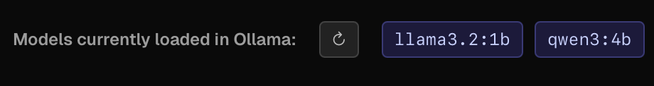

Chronological list of notable changes to Ollama UI.

## 2025-08-13

- **Theme & UI Consistency**
  - Added possibility to choose theme
    - Now two themes are available Default (the one you already know) and Dark Green.
      
  - Added Settings view
    - Theme Chooser
    - All relevant localStorage settings are shown readonly in the settings view (client-only, hydration-safe).
    - Last selected model per host is now persisted in localStorage and restored automatically.
    - "Delete Confirmations Settings" - When enabled, deleting a model requires a second click (“Sure?”) to confirm. Disabling allows immediate deletion with a single click.

- **Quality of Life**
  - Settings and Infos sections are now visually separated and clearly labeled.
  - UI and settings layout further streamlined for clarity and consistency.

- **Fix Issues**
  - CSS issues in docker image, white background and I can't see anything. #3 - Fixed, standard is now dark. (maybe will add other themes later).

## 2025-08-12

- **Chat View**
  - Added indicator which models are loaded in Ollama (api/ps)
    

- **Dashboard Integration:**
  - Added a new Dashboard view combining model statistics, interactive charts, and release notes in one place.
  - Visualizations include bar and pie charts for model sizes and distribution.
  - Model stats update automatically when switching hosts.
    
  - Release notes/news are now shown directly in the dashboard; the separate News page and menu entry have been removed.
  - UI and navigation streamlined for easier access to all features.
    
- **Navigation Restoration:**
  - Chat view is now available again at `/chat` with a dedicated navigation link.
  - Dashboard remains the start page and first in the menu.

- **Host Manager & Indicator:**
  - Host Manager modal accessible from header (gear icon) with add/edit/delete/test & activation.
    
    When now clicking on "Gear-Button" you will get modal for host settings:
    
    Here you can switch between host, add new hosts and so on.
  - Enhanced host indicator (full URL + label tooltip, status & latency display).
  - Inline host management removed from Models view; centralized management in header.

- **Build & Workflow:**
  - Improved Docker build workflow logic (conditional builds based on relevant changes & base image digest) earlier in development cycle.

## 2025-08-11

- Initial refactors preparing for modal-based host switching.

## 2025-08-10 / 2025-08-09

- Added multi‑host management (save, edit, activate, delete) persisted in SQLite.
- Removed legacy cookie + fallback host resolution; now a host must be explicitly added & activated (or provided via header / env on server routes).
- Added global Active Host indicator (header badge) with connectivity & latency test (click to retest).
- Introduced Add Host modal with inline URL validation & connectivity Test button.
- Added inline edit for saved hosts (URL & label) with conflict detection.
- Added host connectivity test API: `POST /api/hosts/test`.
- Added capability filters (Embedding / Vision / Tools / Thinking) + clear button to catalog view.
- Improved catalog display: "Showing X of Y models" with proper total fallback logic.
- Grouped search, filters, limit selector into cohesive panel; improved layout order (Pull box now directly under catalog header).
- Added progress bar & NDJSON parsing improvements for model pull (percentage derivation if missing upstream).
- Added defensive JSON parsing & error handling across host/model routes; uniform 428 response when no host configured.
- Added nightly Docker build schedule (02:30 UTC) to CI workflow.
- Implemented Add Host modal connectivity test ("Ollama is running" or fallback to /api/tags) with timeout.
- Introduced Release Notes, Disclaimer sections in README.
- Active host header badge now updates instantly after activating a host (custom `active-host-changed` event dispatch from Models view).
- Replaced remaining `any` usages with typed interfaces (Hosts API) to satisfy ESLint `@typescript-eslint/no-explicit-any` rule.

### Earlier Changes

- Initial feature set: installed models list, pull & delete, remote catalog browsing with variants, toasts, streaming chat endpoint, Python scraper integration, Docker build (combined Ollama + UI), gradient UI theme.
