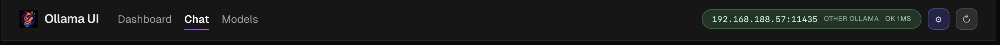
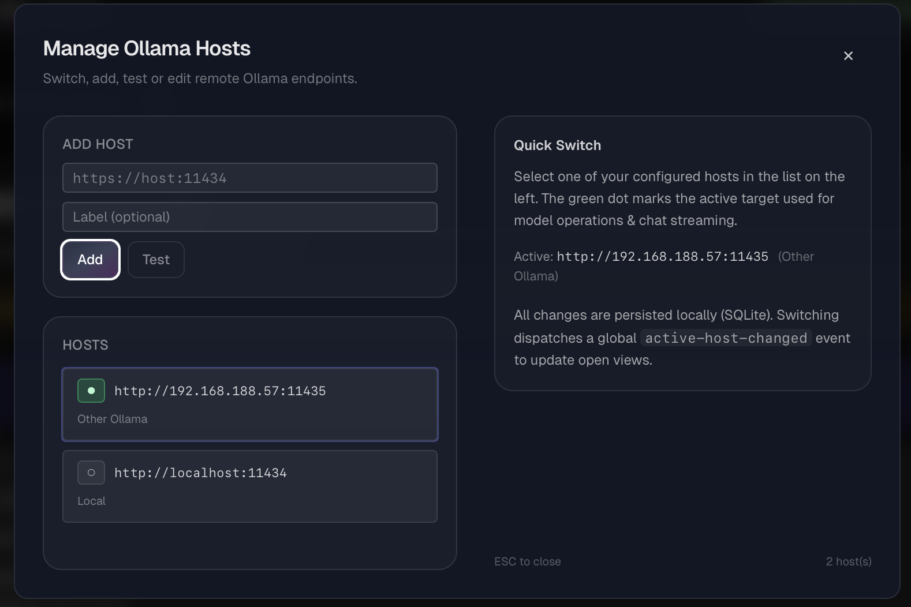
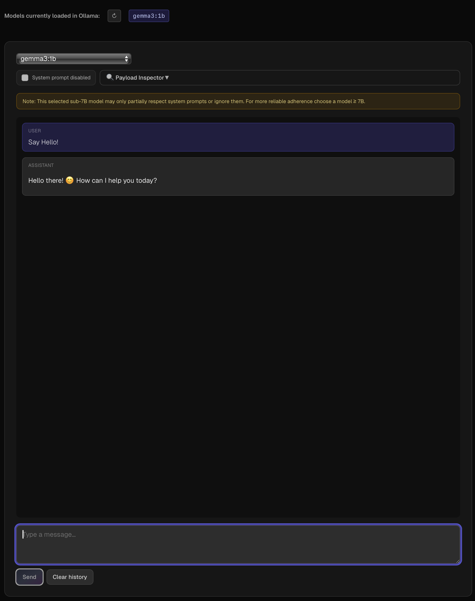
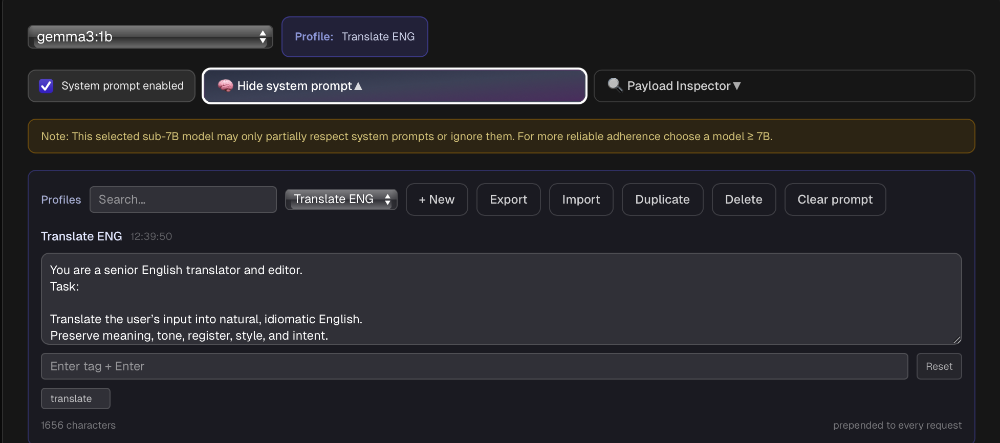
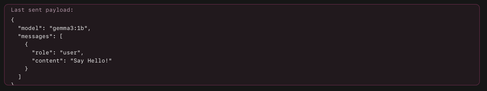
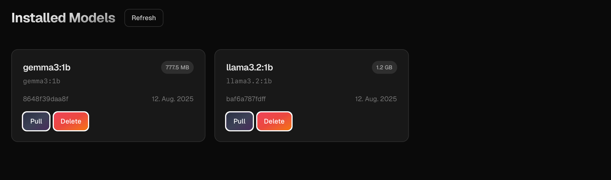
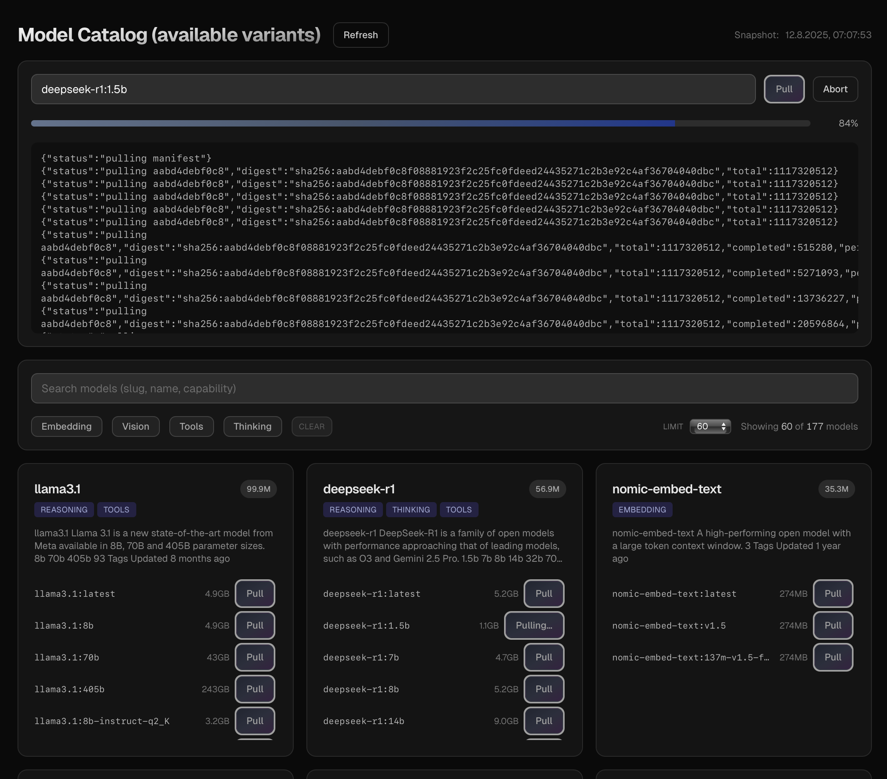
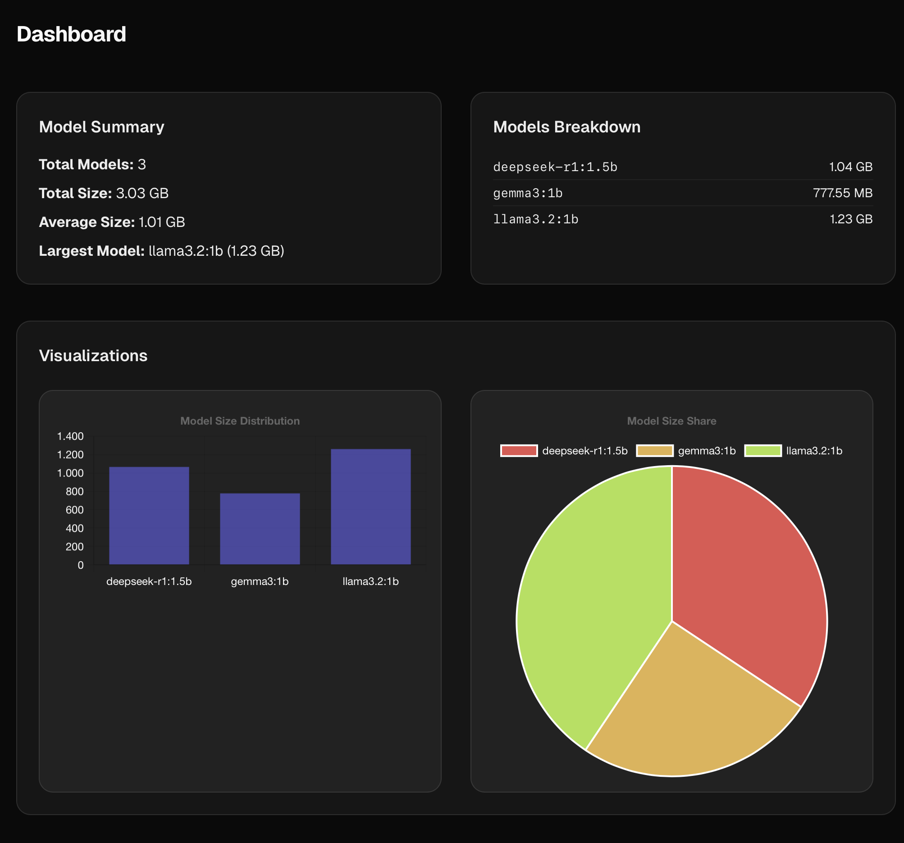
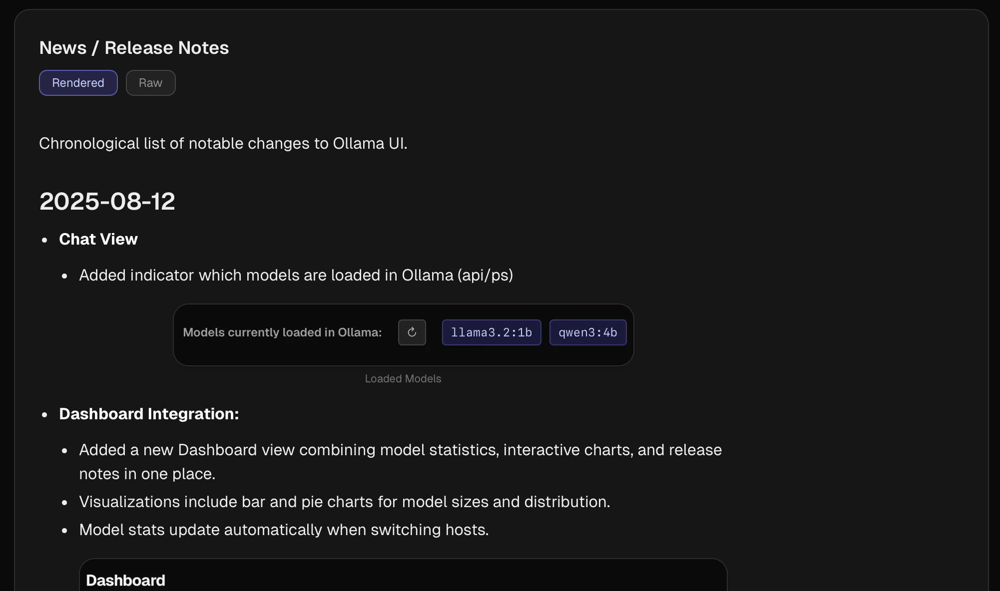

# Ollama UI – User Guide
## 1. Overview
Welcome to the Ollama UI! Think of it as the cockpit of your AI plane: you push the buttons, the complexity stays in the engine room. With Ollama UI you manage models, chat with them, and control connections to your hosts—all in a clean web interface that doesn’t look like a 90s admin panel.

## 2. The Main Window – Your Cockpit
On launch, you’re greeted by a clear, tidy interface. The top header always shows which host you’re connected to and how healthy the connection is. From there you can jump straight to Host Management. 

The main area adapts to whatever you’re doing. Use the navigation to switch between **Dashboard**, **Chat**, and **Models**. 

The Dashboard is your home base—less fluff, more useful info.

## 3. Host Management – Your Link to AI
“Host” sounds grand, but it’s simply the machine / container running Ollama and the models—anything from your laptop to a beefy server on the network. 

Ollama UI handles multiple hosts without turning your life into cable spaghetti.

In the Host Manager (the gear icon up top) you add new hosts, edit existing ones, or test connections. A quick check tells you if things are up, and one click switches the active host. 

Handy when you’re hopping between a “playground” and a “do-not-touch” environment.

## 4. Chat – Direct Dialogue with the AI
Here’s where the action is: pick a model, start typing, get answers (and also see which model is actually being used/loaded by Ollama). 

The interface is intentionally simple—like a messenger, minus the GIF avalanche.

The star of the show: system prompts (profiles). 

They give your AI a baseline role. Today sober developer replies, tomorrow creative ad copy, the day after pirate-speak—go wild. Create, save, and switch profiles so you control tone and behaviour without re-explaining “how” to answer every time.

As a third part in the chat you can use the Payload Inspector functionality to see the payload which is been seen to Ollama

## 5. Model Management – Your Toolbox
Models are specialised tools: one tightens code, another polishes text, a third translates reliably. In the Models section you see what’s installed on the active host.

Missing something? Browse the public catalog and download new models—with a live progress display. No longer need a model? Remove it to reclaim space. Keep the toolbox capable, not cluttered.

## 6. Dashboard – Everything at a Glance
The Dashboard is your quick briefing: number of installed models, used storage, largest model—presented clearly, with charts that say more than three paragraphs.

You’ll also find News and Release Notes right here. Stay up to date on updates and improvements without trekking through the documentation jungle.

## 7. FAQ

**Q:**  How do I switch hosts?
**A:**  Click the gear icon, open the Host Manager, pick your host, activate. Done.

**Q:**  What does the coloured “pill” in the header mean?
**A:** Status at a glance: Green = reachable, Red = not reachable, Yellow = no host configured yet.

**Q:** What’s a system prompt/profile?
**A:** A baseline instruction or role for the AI (e.g., “Answer like an experienced developer”) that applies throughout the chat—less typing, more consistent answers.

